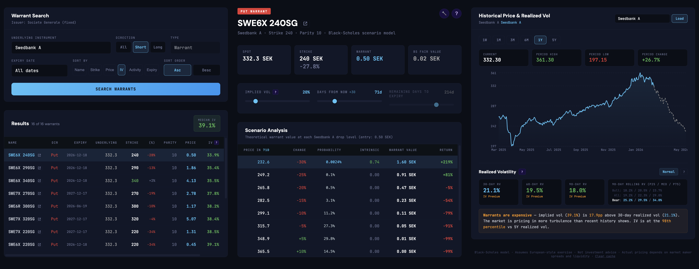

# Avanza Warrant Tools

A React web app for searching, analyzing, and pricing warrants listed on Avanza. Combines real-time warrant data with Black-Scholes modeling to help evaluate warrant pricing.

Uses Avanza's internal API — no authentication required.



## Features

### Warrant Search
- Filter warrants by underlying instrument, direction (call/put), type (vanilla, turbo, knockout, mini future), issuer, and expiry date
- Results show live prices, strike, parity, and calculated implied volatility
- Activity score ranking based on trading volume
- Direct links to warrant pages on Avanza

### Implied Volatility
- Newton-Raphson IV solver for each warrant using Black-Scholes
- Median IV auto-calculated across search results
- IV vs realized volatility comparison to identify expensive/cheap warrants

### Scenario Analysis
- Click any warrant row to populate the calculator
- Theoretical P&L across different underlying price moves
- Adjustable inputs: spot, strike, parity, volatility, days to expiry, risk-free rate

### Historical Price Chart
- Interactive price chart for the underlying instrument (1W to 5Y)
- 30/60/90-day realized volatility with regime classification
- Rolling 90-day RV distribution (5-year lookback) split by up/down periods
- IV percentile rank against historical RV
- Simulated price path overlay from scenario analysis

### Shell Scripts
- `search-warrants.sh` — search and filter warrants from the command line
- `get-warrant.sh` — fetch details for a single warrant by orderbook ID

## Prerequisites

- [Node.js](https://nodejs.org/) (v18+)
- [Bun](https://bun.sh/) (package manager)

Install Bun if you don't have it:

```bash
curl -fsSL https://bun.sh/install | bash
```

## Installation

```bash
git clone <repo-url>
cd avanza
bun install
```

## Usage

### Web UI

```bash
bun run dev
```

Opens at http://localhost:5173.

### Shell Scripts

```bash
# Search warrants (e.g. Swedbank A puts)
./search-warrants.sh -u 5241 -d short -t plain_vanilla

# Get details for a specific warrant
./get-warrant.sh 2072779

# See all filter options
./search-warrants.sh --list-options
```

## Dependencies

### Runtime
| Package | Purpose |
|---|---|
| [react](https://react.dev/) | UI framework |
| [react-dom](https://react.dev/) | React DOM rendering |
| [recharts](https://recharts.org/) | Charts (historical price, area charts) |

### Development
| Package | Purpose |
|---|---|
| [vite](https://vite.dev/) | Dev server and bundler |
| [@vitejs/plugin-react](https://github.com/vitejs/vite-plugin-react) | React JSX/HMR support for Vite |

## Architecture

```
src/
  main.jsx                 # App entry point
  warrant-calculator.jsx   # Search, IV solver, BS calculator, scenario table
  historical-chart.jsx     # Price chart, realized vol, IV vs RV analysis
index.html                 # Shell HTML
vite.config.js             # Vite config with API proxy
search-warrants.sh         # CLI warrant search
get-warrant.sh             # CLI warrant detail fetch
```

The Vite dev server proxies `/api/*` requests to `https://www.avanza.se/_api/*` to avoid CORS issues.

## Notes

- These APIs are **undocumented and unofficial**. They can change without warning.
- Data may be delayed by 15 minutes.
- Avanza's terms of use prohibit automated access without written consent.
